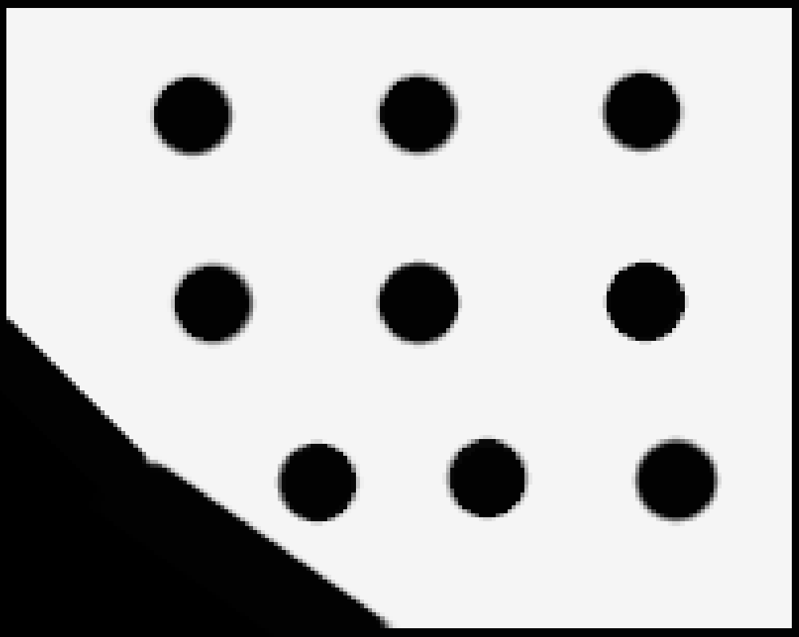
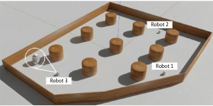
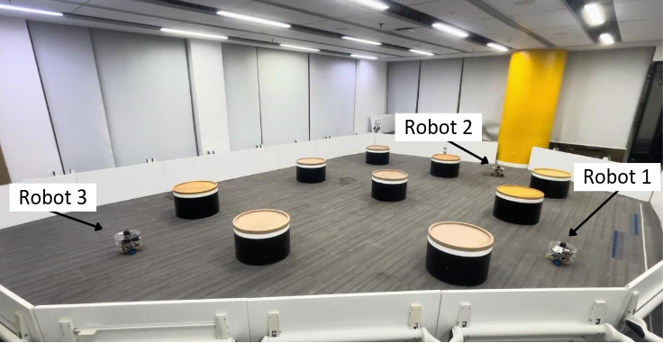

# Bi-Layer Ant Colony Optimization for Multi-Robot Multi-Depot Pickup and Delivery

This repository implements a **multi-robot task allocation and routing framework** using **Ant Colony Optimization (ACO)**, where all travel costs are computed using **A\*** path planning on an occupancy grid map.

The system assigns pickup–dropoff tasks to multiple robots, determines the visiting sequence for each robot, and visualizes both the **initial random ant solution** and the **optimized ACO solution**.

---

## Features

- **Ant Colony Optimization (ACO)** for task assignment and sequencing  
- **A\*** path planning on a grid-based map for accurate distance estimation  
- Supports **multiple robots**, **multiple tasks**, and **task-specific drop-off locations**  
- Penalizes unreachable paths with a large cost to ensure feasibility  
- Generates **visualizations** and **CSV logs** for convergence analysis  
- Fully deterministic experiments via fixed random seeds  


---

## Problem Description

- Each robot starts from a predefined position.
- Each task consists of:
  - A **pickup location**
  - A corresponding **drop-off location**
- Robots must:
  1. Travel from their start position to assigned pickup points
  2. Move from pickup to drop-off
  3. Continue to the next assigned task
- The objective is to **minimize the total travel distance** of all robots.

Distances are computed using **A\*** on an occupancy grid rather than Euclidean distance.

---

## Map and Environment

- Map is loaded from a ROS-style YAML file:
  ```text
  swarm_arena_map.yaml
- The YAML file must reference a grayscale occupancy image: `swarm_arena_map.pgm`
<p align="center">
  
</p>

The occupancy grid map is obtained from a **Gazebo simulated world**, which models the structure and obstacles of the real environment.  
This simulation-based approach allows safe and repeatable testing before deployment in real-world scenarios.

<div align="center">

<table>
  <tr>
    <th>Gazebo Simulated World</th>
    <th>Real Environment</th>
  </tr>
  <tr>
    <td>
      
    </td>
    <td>
      
    </td>
  </tr>
</table>

</div>

## Algorithm Overview

### Distance Computation

- All distances are computed using **A\*** path planning on a grid-based occupancy map
- An **8-connected neighborhood** is used to allow diagonal movement
- If no valid path exists between two locations, a large penalty cost is assigned to discourage infeasible solutions

```python
MAX_PENALTY = 1_000_000
```
This ensures that the optimization process favors feasible paths while still allowing the algorithm to proceed.

### Ant Colony Optimization (ACO)

Ant Colony Optimization is used to solve the **multi-robot task allocation and routing** problem.  
The algorithm optimizes both **task assignment** and **task visiting order**.

The optimization is performed in two stages:

1. **Task Assignment**  
   Each task is probabilistically assigned to a robot based on pheromone intensity and heuristic desirability.

2. **Task Sequencing**  
   For each robot, the visiting order of assigned tasks is optimized to minimize total travel distance.

---

### Key ACO Parameters

```python
num_ants = 30
num_iterations = 100
alpha = 1.0        # pheromone importance
beta = 2.0         # heuristic importance
rho = 0.1          # pheromone evaporation rate
q = 100.0          # pheromone deposit factor
```

### Optimization Process

At each iteration:

- Multiple ants construct candidate solutions  
- Pheromone trails are updated based on solution quality  
- The **best solution (minimum total distance)** is retained  

Over successive iterations, the algorithm converges toward high-quality task allocations and optimized robot routes.


## How to run 

### Step 1: Install the required Python packages:

```bash
pip install numpy pillow matplotlib pyyaml
```

### Step 2: Execute:

```bash
python main.py
```
The script will:

1. Load the occupancy grid map  
2. Randomly sample valid task and drop-off locations  
3. Compute all **A\*-based distance matrices**  
4. Run **ACO optimization**  
5. Save convergence data to CSV  
6. Generate and save visualization figures 

## Outputs

### 1. CSV Convergence Log

```text
distances_over_iterations.csv
```


Contains per-iteration statistics:

| Column | Description |
|------|-------------|
| algorithm | Always `"ACO"` |
| iteration | Iteration index |
| iter_best_total_distance | Best solution in that iteration |
| best_so_far_total_distance | Global best up to that iteration |
| unique_costs | Reserved (currently unused) |

---

### 2. Visualization Figures

- **figure1_initial_setup.png**  
  Initial random ant solution (first iteration)

- **figure2_aco_optimized.png**  
  Final optimized ACO solution

Paths are plotted using **A\*** trajectories between waypoints.